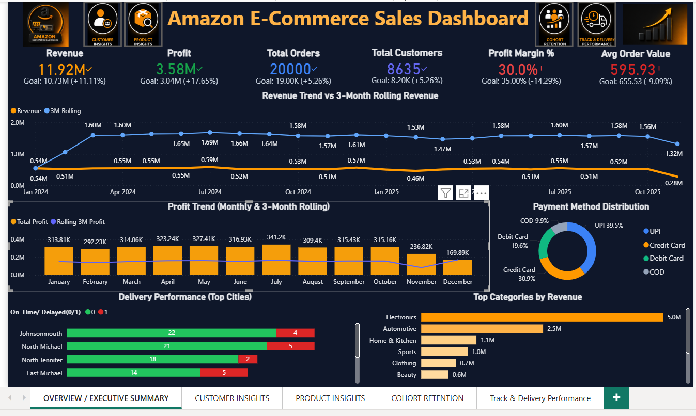
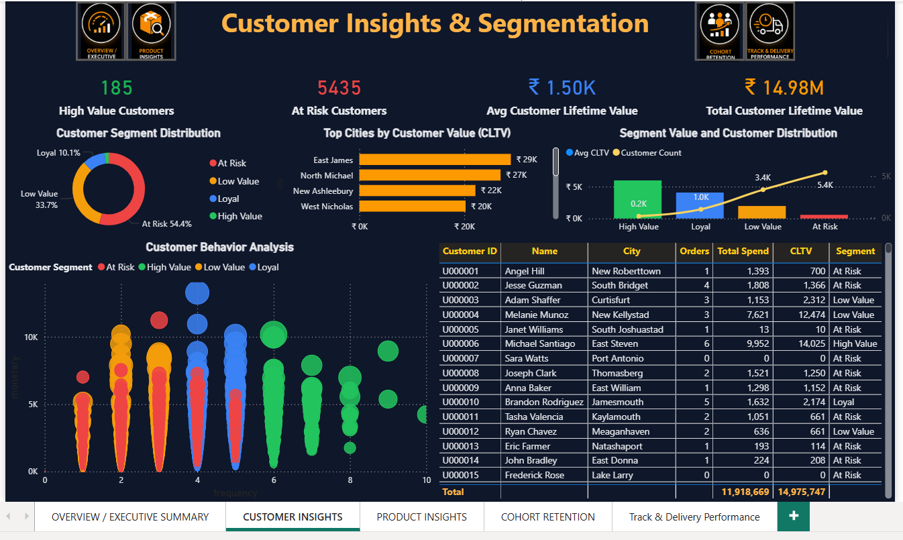
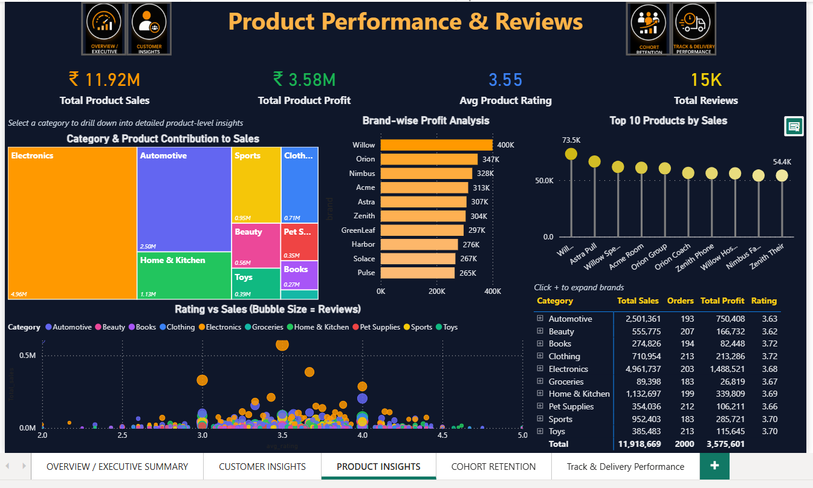
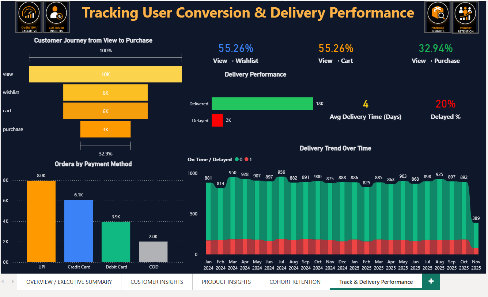

# 🛒 Amazon E-Commerce Sales Dashboard

An end-to-end **Business Intelligence project** built with **SQL → Python → Power BI**

---

## 📌 Project Overview

This project is a complete data analytics pipeline — starting from raw e-commerce data and ending with an interactive **5-page Power BI dashboard**.

The goal was to analyze an Amazon-style e-commerce dataset and build a dashboard that helps business teams understand:

- Overall sales and profit performance
- Customer behavior and segmentation
- Product and brand performance
- Customer retention trends
- Funnel conversion and delivery efficiency

---

## 🗂️ Project Workflow

**Raw Dataset → SQL (Clean & Model) → Python (Analyze & Engineer) → Power BI (Visualize)**

---

## 🛠️ Tools & Technologies

| Tool | Purpose |
|------|---------|
| SQL Server | Data cleaning, joins, fact & dimension table creation |
| Python (Pandas) | Cohort analysis, funnel analysis, rolling metrics, feature engineering |
| Power BI | Data modeling, DAX measures, interactive dashboard |

---

## 📁 Dataset Tables

The raw dataset included:

- `customers` — customer details
- `orders` — order records
- `products` — product information
- `order_items` — line-level order data
- `events` — user funnel events (`view`, `wishlist`, `cart`, `purchase`)
- `reviews` — product ratings and reviews
- `payments` — payment method data
- `shipping` — delivery and shipping data

---

## 🔷 Step 1: SQL Work

### What I did

- Imported all raw tables into SQL Server
- Checked for null values, duplicates, incorrect joins, and invalid rows
- Validated key columns: `customer_id`, `order_id`, `product_id`, and date fields

### Output — Star Schema

#### Fact Table
- `fact_sales`

Built at **order-item level** and includes:

- `order_id`
- `customer_id`
- `product_id`
- `revenue`
- `profit`
- `margin_pct`
- `delivery_days`
- `delayed`
- `payment_method`
- and more

#### Dimension Tables

- `dim_customer` — customer details + RFM metrics + customer segment
- `dim_product` — product details + aggregated sales and rating data

---

## 🔶 Step 2: Python Work

### CSV files used as input

- `fact_sales.csv`
- `dim_customer.csv`
- `dim_product.csv`

### Output files created

| Output File | Description |
|------------|-------------|
| `customer_upgrade.csv` | Extended customer data with CLTV and improved segmentation |
| `cohort_analysis.csv` | Cohort month, cohort index, retention rate |
| `monthly_summary.csv` | Monthly orders, revenue, profit, AOV |
| `rolling_metrics.csv` | 3-month rolling revenue, profit, and orders |
| `funnel_data.csv` | Funnel stages with conversion rates |
| `review_summary.csv` | Product-level average rating and total reviews |

---

## 🔵 Step 3: Power BI Dashboard

### Data Model

### Relationships created

- `customer_upgrade[customer_id] → fact_sales[customer_id]`
- `dim_product[product_id] → fact_sales[product_id]`
- `dim_product[product_id] → review_summary[product_id]`

**Summary tables** (`cohort`, `funnel`, `monthly`, `rolling`) were used as standalone reporting tables.

### DAX Measures Created

- Total Revenue
- Total Profit
- Profit Margin %
- Avg Order Value
- Delayed Orders
- Delayed Order %
- Avg Delivery Days
- High Value Customers
- At Risk Customers
- Avg CLTV
- Total CLTV
- Avg Product Rating
- Total Reviews
- View → Wishlist conversion rate
- View → Cart conversion rate
- View → Purchase conversion rate

---

## 📊 Dashboard Pages

## Page 1 — Overview / Executive Summary

### Key Numbers

- **Revenue:** ₹11.92M (**Goal:** ₹10.73M → **+11.11%** ✅)
- **Profit:** ₹3.58M (**Goal:** ₹3.04M → **+17.65%** ✅)
- **Total Orders:** 20,000
- **Total Customers:** 8,635
- **Profit Margin:** 30% (**Goal:** 35% ⚠️)
- **Avg Order Value:** ₹595.93

### Visuals

- Revenue trend
- Profit trend
- Payment method donut chart
- Delivery by city
- Top categories

---

## Page 2 — Customer Insights & Segmentation

### Key Numbers

- **High Value Customers:** 185
- **At Risk Customers:** 5,435 (**54.4% of customer base** ⚠️)
- **Total CLTV:** ₹14.98M
- **Avg CLTV:** ₹1.50K

### Visuals

- Segment donut chart
- Top cities by CLTV
- Segment value chart
- Customer behavior scatter plot
- Customer detail table

---

## Page 3 — Product Performance & Reviews

### Key Numbers

- **Total Product Sales:** ₹11.92M
- **Profit:** ₹3.58M
- **Avg Rating:** 3.55 / 5
- **Total Reviews:** 15K

### Visuals

- Category treemap
- Brand-wise profit
- Top 10 products
- Rating vs Sales bubble chart
- Category summary table

### Highlights

- **Top Category:** Electronics (₹4.96M)
- **Top Brand:** Willow (₹400K profit)

---

## Page 4 — Cohort Retention Analysis

### Key Numbers

- **Best Cohort Retention:** 14.80%
- **Month 2 Retention:** 8.4%
- **Month 3 Retention:** 8.2%

### Visuals

- Full cohort heatmap matrix (`Jan 2024 → Jan 2025`)
- Month 2 retention bar chart
- Month 3 retention bar chart

### Insight

- **April 2025 cohort** had the highest **Month 2 retention** at **14.8%**

---

## Page 5 — Track & Delivery Performance

### Key Numbers

- **View → Purchase Conversion:** 32.94%
- **Delivered On Time:** 18K
- **Delayed:** 2K
- **Avg Delivery Time:** 4 days
- **Delayed %:** 20%

### Visuals

- Customer journey funnel (`10K view → 3K purchase`)
- Delivery trend over time
- Orders by payment method

---

## 📸 Dashboard Preview

### 🔹 Overview Dashboard

### 🔹 Customer Insights

### 🔹 Product Performance

### 🔹 Cohort Retention Analysis

### 🔹 Track & Delivery Performance

---

## 💡 Key Business Insights

- Revenue exceeded target by **11%** — strong overall performance
- **54%** of customers are **At Risk** — urgent need for re-engagement campaigns
- **Electronics** drives **42%** of total revenue
- **20%** delivery delay rate — logistics improvement needed
- Only **32.9%** of viewers convert to buyers — funnel optimization opportunity
- **UPI** is the dominant payment method (**39.5%** of orders)
- Best retention cohort: **April 2025** — worth studying what worked

---

## 🧠 Skills Demonstrated

- ✅ SQL data cleaning and star-schema modeling
- ✅ Python for cohort analysis, funnel analysis, rolling metrics, and feature engineering
- ✅ Power BI data modeling, relationships, DAX, and interactive multi-page dashboard
- ✅ Business storytelling through data visualization
- ✅ End-to-end project execution from raw data to dashboard

---

## 👤 Author

**Sayan Naha**

📧 **Email:** snsayan2012@gmail.com  
🔗 **LinkedIn:** [Sayan Naha](https://www.linkedin.com/in/sayan-naha/)

---
